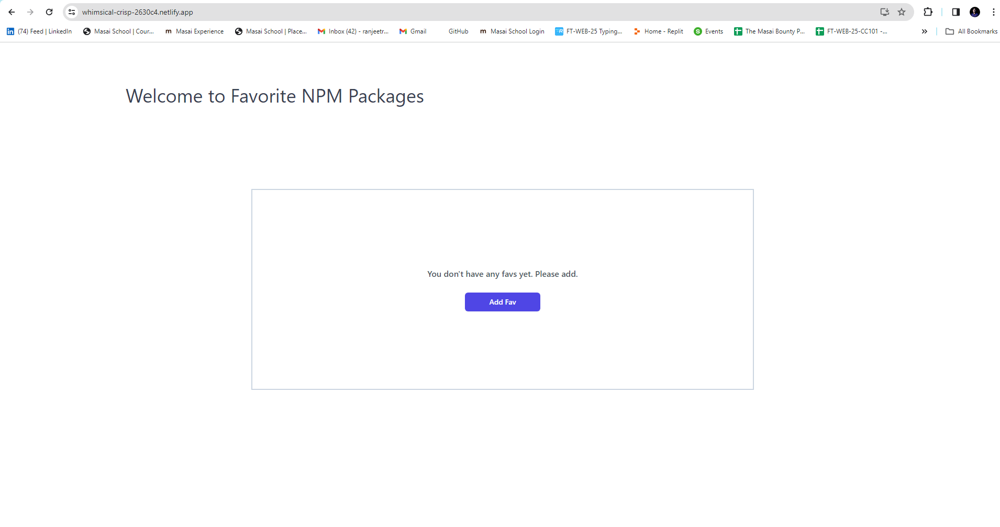
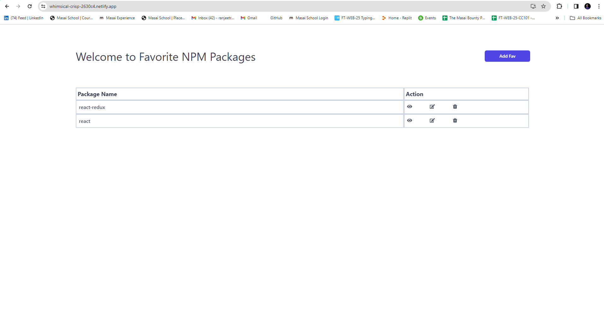
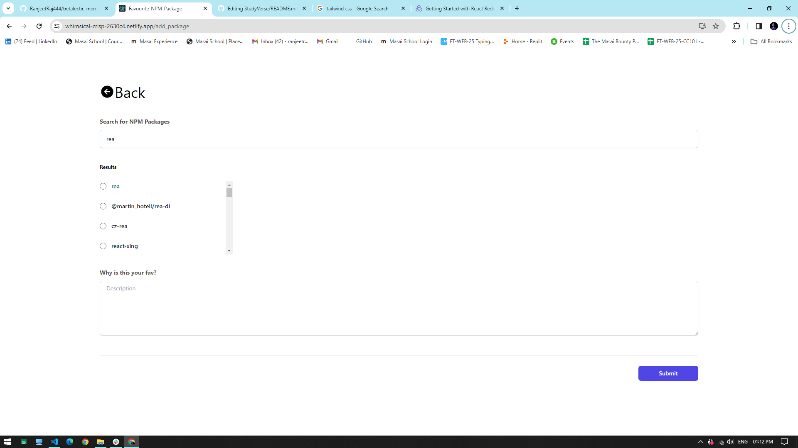
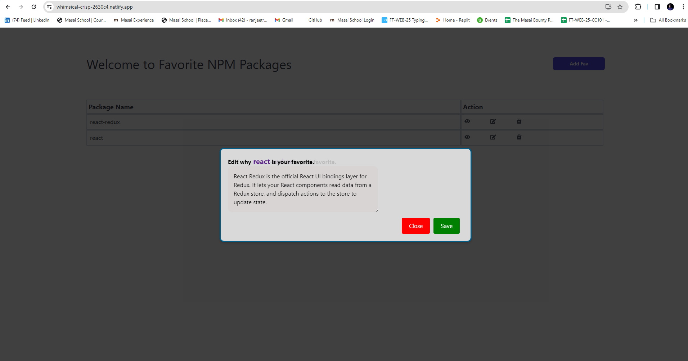
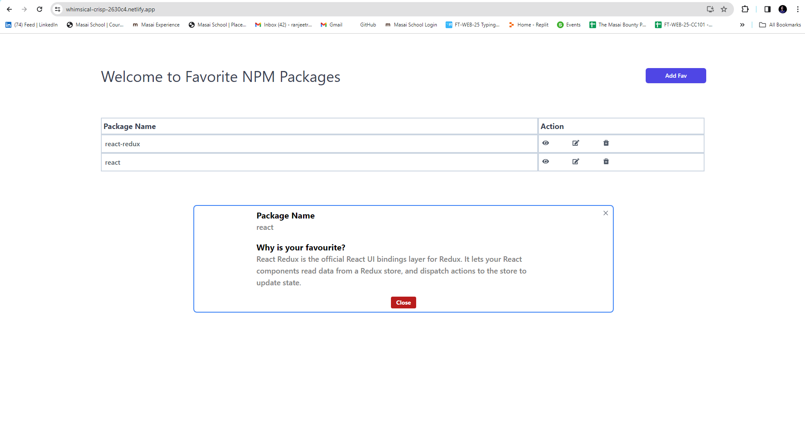
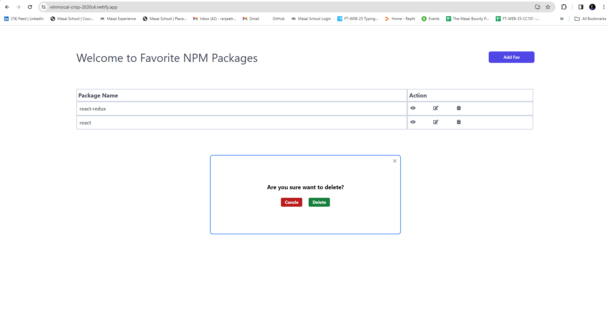

# Favorite NPM Packages

Description:- A website created for search npm packages and it to your favorite lists.

## site link:- https://whimsical-crisp-2630c4.netlify.app/

This is a search NPM packages website built with React with TypeScript, for styling Tailwind CSS, and powered by a Local Storage.

## Table of Contents

- [Introduction](#introduction)
- [Features](#features)
- [Usage](#usage)
- [Technologies Used](#technologies-used)

## Introduction

A website created for search npm packages and it to your favorite lists.

### Landing page without any packages in favorite list

### Landing page after adding some package to favorite list

## Features

- User can search various npm packages.
- Also write why is favourite.
- View it.
- Edit the description part.
- And delete the npm packages.

### Search page for packages.

#### edit modal

### View modal

### Delete modal

## Technologies Used

- React for building user interfaces with TypeScript
- Propdrilling and context API for state management
- Tailwind CSS for styling
- Axios for API requests
